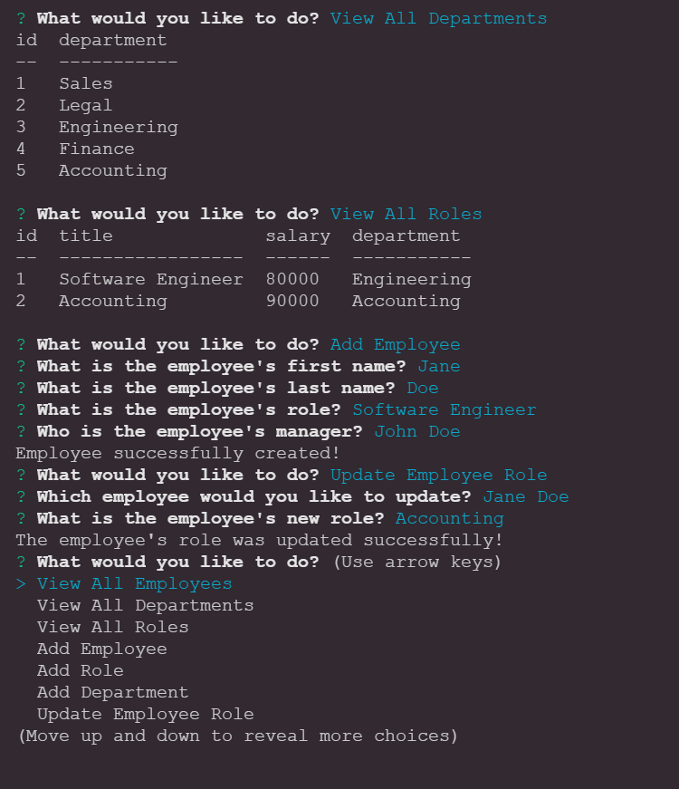

# Employee-Tracker  
  
  
  ## Description:  
  A CLI based application/tool to manage your employee database. Functions include viewing, updating, adding, and deleting employee data.

  ## Table of Contents:  
  - [Description](#-description)
  - [Table of Contents](#-table-of-contents)
  - [Installation](#-installation)
  - [Usage](#-usage)
  - [License](#-license)
  - [Contributing](#-contributing)
  - [Tests](#-tests)
  - [Questions](#-questions)

  ## Installation:  
    Clone repo, install all dependencieis, and run from command line 'node app.js'

  ## Usage:  
  Simply start the program and follow the prompts.
  
  ## License:  
  Licensed under [MIT](./LICENSE)
  
  ## Contributing:  
  Myself
  
  ## Tests:  
  Track Employee Data

  
  
  ## Questions:  
  Contact Me: [Github](https://www.github.com/Kyle004)
  Email Me at: codingky@gmail.com  
  Repository Link [Employee-Tracker](https://github.com/kyle004/MySQL-Employee-Tracker)

